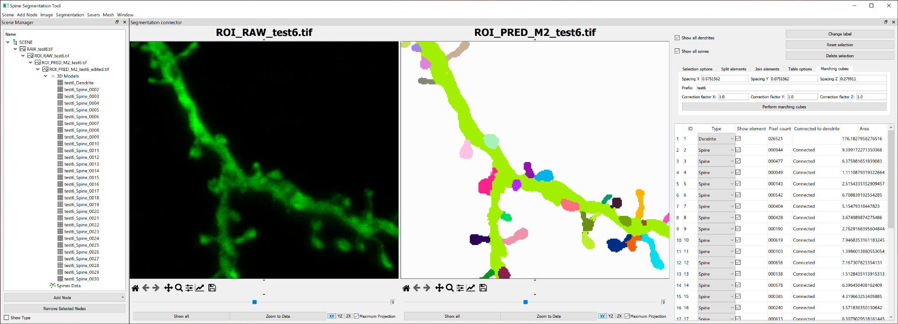

# DeepSpineTool
This repository contains our GUI application for automatic spine segmentation and refinement. 

## Installation for Windows 10
We provide an executable ready to run in Windows 10. To have short segmentation times, we recommend running our application on a system with an NVIDIA GPU with at least 8 GB of VRAM. Otherwise, the segmentation process will be done on CPU and will be slower.
To use this executable:
1. Download `DeepSpineNetTool.zip` from https://bit.ly/3usWxyv
2. Extract the previous file
3. Open the newly extracted folder and execute `DeepSpineNetTool.bat` 

If you have a compatible GPU, please ensure that your GPU drivers are up-to-date.

## Building and installation (any system)
Our application can also be installed in any operating system that supports its dependencies. It requires **Python 3.6.8 or later** and **CUDA 10.1** (to enable the use of GPUs to greatly reduce the automatic segmentation time. It can be used without CUDA on CPU, with a longer execution time.).

1. Download the current project:
   > git clone https://github.com/vg-lab-dl/DeepSpineTool.git
2. Install dependencies (from the root directory of the project):
   > pip install -r requirements.txt.
3. Download our models (`models.zip`) from https://bit.ly/3usWxyv
4. Extract the previous file in the root folder of the project. 

After the previous steps, folder structure should be:
* `DeepSpineTool`
     * `app`
     * `models`
        * `M1`
        * `M2`
        * `M3`
     * ...
 
## Usage
To present our application functionality, we provide a sample project. It can be downloaded from: https://bit.ly/3usWxyv (`sample.scn`) 

#### Running the application
* To start the tool, use the following command (if using the executable: Open `DeepSpineNetTool.bat`):
    > python main.py

* Once the main window appears, in the upper menu, open the sample project with  `Scene` > `Load` and accept the prompt message.
* Locate the sample project and open it.

#### View an image
* To view the image, select it in the `Scene Manager` pane, for example, you can choose `ROI_RAW_test6.tif`
* In the upper menu, hover on `Image` > `Viewers` and click on `Basic Image 3D Viewer` 

#### Segment an image
* To segment the image, select `ROI_RAW_test6.tif` in the `Scene Manager` pane
* In the upper menu, hover on `Segmentation` > `Deep Learning` and click one of `M1` `M2` or `M3` (If no option shows when hovering over `Deep Learning`, the model folder has not been placed correctly, please check the installation instruction)
* Click on the `Close when finished` checkbox from the progress prompt and wait for the process to finish
* The segmented image has been added to the `Scene Manager` pane (`ROI_RAW_test6.tif (Seg: u_net3d_deep)`) and can be viewed following the steps from the previous section

#### Edit a segmentation
* To edit the segmentation, select `ROI_RAW_test6.tif` and `ROI_RAW_test6.tif (Seg: u_net3d_deep)`(or `ROI_LABEL_test6.tif` if you didn't perform the automatic segmentation) in the `Scene Manager` pane.
* In the upper menu, hover over `Segmentation` and click on `Segmentation Editor`.
* In the prompt, select the prediction image, `ROI_RAW_test6.tif (Seg: u_net3d_deep)` (or `ROI_LABEL_test6.tif` if you didn't perform the automatic segmentation), from the list. The segmentation editor will open.
* Our app stores the changes in an automatically created image (`edition_ROI_RAW_test6.tif (Seg: u_net3d_deep)`), if you want to save the current work and continue it later, next time you will have
 to open the editor with the 3 images selected: `ROI_RAW_test6.tif`, `ROI_RAW_test6.tif (Seg: u_net3d_deep)` and `edition_ROI_RAW_test6.tif (Seg: u_net3d_deep)`.

## Acknowledgments
The authors gratefully acknowledges the computer resources at Artemisa, funded by the European Union ERDF and Comunitat Valenciana as well as the technical support provided by the Instituto de Física Corpuscular, IFIC (CSIC-UV).

## License
DeepSpineTool is distributed under a Dual License model, depending on its usage. For its non-commercial use, it is released under an open-source license (GPLv3). Please contact us if you are interested in commercial license.
